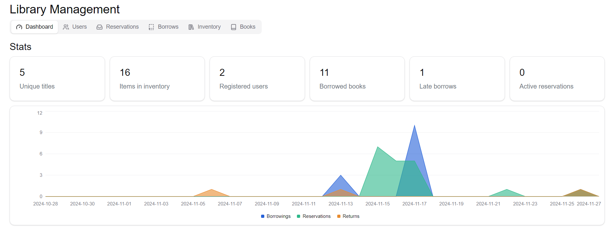

# Library Inventory & Platform

## Technology Stack
### Backend
- Gradle, Spring, Spring Security, JWT, Liquibase, Hibernate, Postgresql
### Frontend
- NextJS, Tanstack-query, Tailwind, Shadcn/ui

## Features

### Users
- Users can sign up and sign in
- Stateless user authentication with JWTs
- Users can rate books they have borrowed and returned successfully

### Inventory 
- Librarians can view the inventory of books
- Librarians can create tags and tag books

### Reservations
- Users can reserve books to borrow at the library
- Librarians can see active and expired reservations
- Librarians can cancel reservations

### Borrowing
- Librarians can mark an item as borrowed by a specific user when a user comes at the library
- Librarians can mark a borrowing as returned
- Librarians can extend the return date for a borrowing
- Librarians can see active, late and the history of borrows for each item

### Dashboard and misc
- Librarians can view stats of active or late borrows, total registered users, etc.
- Librarians can view graphs of reservations, borrows and returns made each day.

## Screenshots




## Setup Backend
```md
1. Install the dependencies with Gradle
2. Run `docker compose up -d`
3. Configure application.properties 
4. Run the spring boot app
```

## Setup Frontend
```md
1. Install the dependencies with npm
2. Set BACKEND in `.env` pointing to the spring API, e.g. http://localhost:8090
3. Run `npm run dev`
```